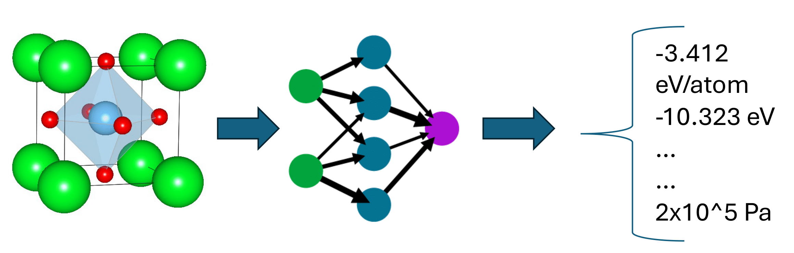
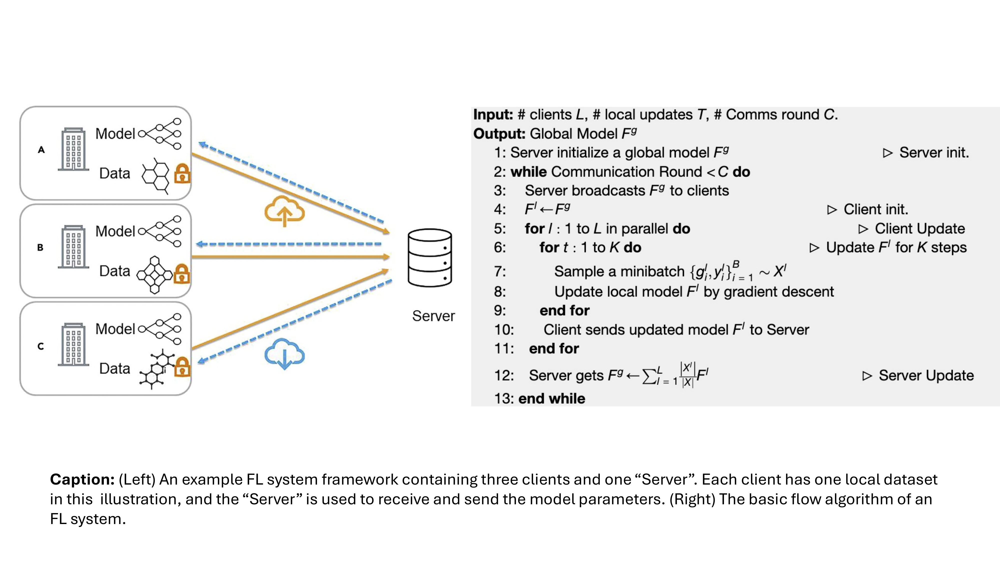
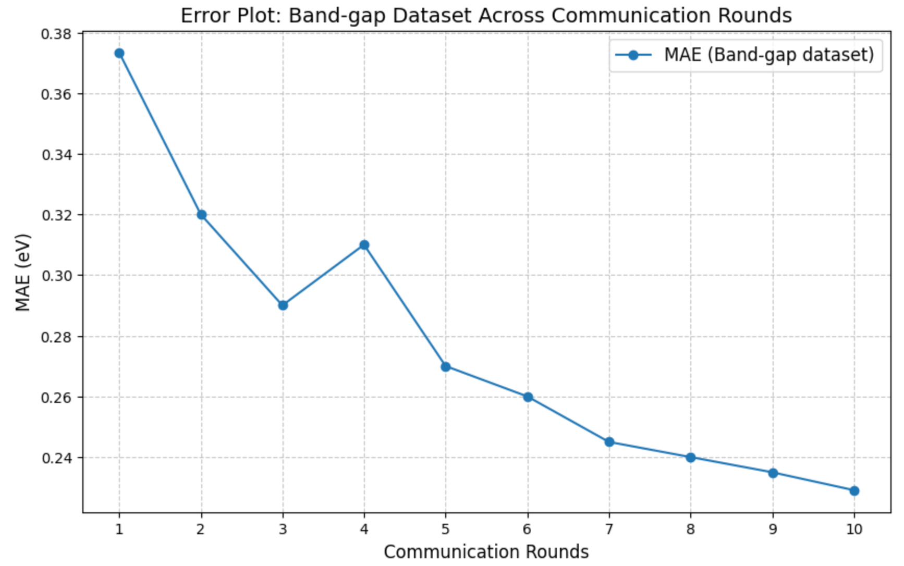
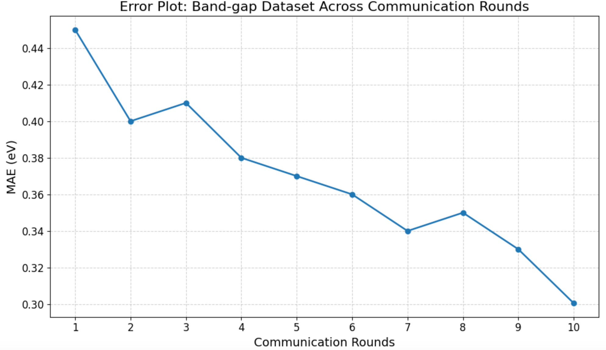
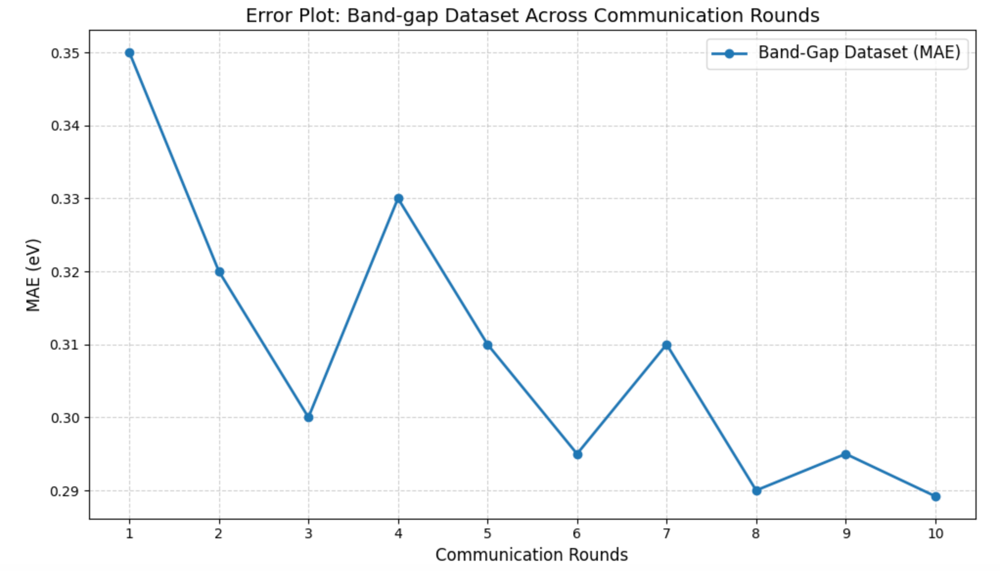

# Federated Learning for Materials Property Prediction (Milestone 3)

## Project Members
- **Sadman Sadeed Omee**  
  Ph.D. Candidate (Computer Science)  
  Role: Machine Learning researcher   
  Email: somee@email.sc.edu
- **Md Hasibul Amin**  
  Ph.D. Candidate (Computer Engineering)  
  Role: Machine Learning researcher   
  Email: ma77@email.sc.edu
---

## Introduction

Materials property prediction has emerged as a crucial aspect of modern materials science, facilitating the discovery of new materials with desirable properties. Machine learning models have made significant strides in predicting these properties from material compositions and structures [1]. However, the limited availability of training data poses a challenge to the accuracy and generalization of these models. Moreover, researchers are more interested in knowing the properties of novel exceptional materials (e.g., having a very high electrical conductivity) that usally fall outside the distribution of known materials set. Federated Learning (FL), a decentralized approach, enables institutions to collaboratively train models without sharing raw data, thus overcoming the data scarcity issue while preserving privacy. Studies has also shown that FL can improve out-of-distribution (OOD) performance in some cases if formulated in a systematic way [2]. This project mostly aims to implement FL for materials property prediction, exploring how well this approach scales with an increasing number of client nodes and assessing the efficiency of the overall system. A secondary goal of this project is to measure how effective FL is in predicting the properties of novel exceptional materials.

## Problem Statement

- **Input**: Material composition or structure data.
- **Output**: Prediction of key material properties, such as formation energy, band gap, etc.

The figure describes the problem, where the material structure is passed through the neural network to get the predicted properties. GNNs are the state-of-the-art models for this task as materials structure are usually encoded as graphs [1].

## Motivating Example

Multiple companies are synthesizing drugs, vaccines, medicines, or synthesizing exceptional materials for commercial usage such as blue led with lower band-gap materials, wire made with high electrical conductivity material, etc. The challenge is to screen materials with desired properties from a colossal materials space. Using density functional theory (DFT)-based solution is costly and time-consuming. Recently, researchers are employing ML-based property predictors for screening materials with desired property with a little accuracy-time trade-off. FL allows an organization to help other oragnizations to develop their own ML model for property prediction for screen desired property materials (e.g., lower refractive index materials' glass, etc.) without explicitly giving away the name of the materials they found experimentally and then synthesized in the lab.

## Proposed Solution

We propose to implement **Federated Learning (FL)** for materials property prediction. FL allows institutions to collaboratively train models on distributed data without exchanging sensitive data, enhancing model accuracy while maintaining privacy. FL is already available for molecular property prediction [3] but has not been applied to materials property prediction to our best knowledge. 

### Federated Learning System Details

Federated Learning (FL) allows for decentralized training of machine learning models across multiple clients (e.g., institutions) without sharing raw data. Each client trains a local model on its private dataset and sends the model updates to a central server. The server aggregates these updates to improve the global model, which is then shared with all clients. Here is an image to and algorithm to describe FL in general.

### Key Steps:
1. **Server Initialization**: The server initializes a global model.
2. **Client Model Training**: Each client trains its local model using its own data and updates it through gradient descent.
3. **Model Update**: Clients send their updated model to the server.
4. **Aggregation**: The server aggregates the local models to update the global model.
5. **Re-distribution**: The updated global model is sent back to the clients for the next training round.

This process continues for multiple communication rounds to improve the global model while preserving data privacy.

## Experimental Setup
### **Model Architectures**
1. **DeeperGATGNN:** Enhanced GNN architecture for property prediction.
2. **SchNet:** Established graph neural network model for both materials and moleucar systems.
3. **MPNN:** Message Passing Neural Network for materials property regression.

### **Datasets**
## **Benchmark experiment datasets:**
| Dataset                                 | Property           | # of Samples |
|-----------------------------------------|--------------------|--------------|
| Bulk Materials Formation energy         | Formation Energy   | 36,839       |
| Alloy Surface                           | Adsorption Energy  | 37,334       |
| Pt-Cluster                              | Formation Energy   | 19,801       |
| 2D-Materials                            | Formation Energy   | 3,814        |
| Band Gap                                | Band Gap           | 36,837       |

## **OOD experiment datasets:**
| Dataset                        | Property           | # of Samples |
|--------------------------------|--------------------|--------------|
| Dielectric                     | Refractive Index   | 4764         |
| Perovskites                    | Formation Energy   | 18,928       |
| GVRH                           | Shear Modulus      | 10,987       |

## **Scalability experiment datasets:**
| Dataset                                 | Property           | # of Samples |
|-----------------------------------------|--------------------|--------------|
| Bulk Materials Formation energy         | Formation Energy   | 36,839       |
| Band Gap                                | Band Gap           | 36,837       |

### **FL Framework**
- **Clients:** Default value 4 for benchmarking results, 5 for OOD results, and varying numbers (3, 4, 10... up to 500) for scalability testing.
- **Weight Update Scheme:** Averaging (initial setup).
- **Libraries:** PyTorch, PyTorch-Geometric, FedML, PyMatGen, ASE, etc.
- **Training Configuration:**
  - Epochs: 500
  - Learning Rate: 0.005
  - Optimizer: AdamW
  - Batch Size: 64
  - Graph convolution layers: 2-5 (SchNet, MPNN), 20 (DeeperGATGNN)
  - Latent embedding dimension: 64
  - Communication round: 10
  - Scaffolding split method: crystal fingerprint-based matching

---

## **Results**

### **Results on benchmarking datasets**
#### Metrics: MAE (Mean Absolute Error)
The baseline results were collected from [4].

| Model            | Band-gap                      | Bulk Materials Formation energy   | 2D Material                    | Alloy Surface                       | Pt-Cluster                      |
|------------------|-------------------------------|-----------------------------------|--------------------------------|-------------------------------------|---------------------------------|
| **DeeperGATGNN** | Baseline: 0.24570 eV          | Baseline: 0.02955 eV/atom         | Baseline: 0.17185 eV/atom      | Baseline: 0.04086 eV/atom           | Baseline: 0.13210 eV/atom       |
|                  | FL (4 clients): **0.2291 eV** | FL (4 clients): 0.07724 eV/atom   | FL (4 clients): 0.2385 eV/atom | FL (4 clients): **0.03642 eV/atom** | FL (4 clients): 0.1468 eV/atom  |
| **SchNet**       | Baseline: 0.28168 eV          | Baseline: 0.05 eV/atom            | Baseline: 0.214 eV/atom        | Baseline: 0.063 eV/atom             | Baseline: 0.151 eV/atom         |
|                  | FL (4 clients): 0.3005 eV     | FL (4 clients): 0.108 eV/atom     | FL (4 clients): 0.306 eV/atom  | FL (4 clients): 0.09 eV/atom        | FL (4 clients): 0.206 eV/atom   |
| **MPNN**         | Baseline: 0.26485 eV          | Baseline: 0.046 eV/atom           | Baseline: 0.204 eV/atom        | Baseline: 0.058 eV/atom             | Baseline: 0.182 eV/atom         |
|                  | FL (4 clients): 0.2892 eV     | FL (4 clients): 0.9293 eV/atom    | FL (4 clients): 0.2974 eV/atom | FL (4 clients): 0.8805 eV/atom      | FL (4 clients): 0.2655 eV/atom  |

**Table**: Performance comparison baseline and federated version of different models on benchmark datasets. Cases where FL version improves benchmark results are marked in bold letters.

#### Observations:
- Overall FL achieved results closer to the baseline results.
- Fine-tuing, or hyperparameter optimization might lead to better performances than the baseline. The better results of DeeperGATGNN's FL version for 2 datasets are good indicators of that.
---

### **Results on OOD Datasets**
#### Experimental Setup:
- 3 OOD datasets with 5-fold splits each.
- Training on 4 folds, testing on the remaining fold.
- Test fold systematically split from out-of-distribution than the training set.

The ID results were calculated from [5]

#### Results:
| Dataset                            | DeeperGATGNN             | SchNet                  | MPNN                  |
|------------------------------------|--------------------------|-------------------------|-----------------------|
| **Dielectric**                     | ID: 0.3355 (unitless)    | ID: 0.3277 (unitless)   | ID: 0.4682 (unitless) |
|                                    | OOD: 0.5079 (unitless)   | OOD: 0.6621 (unitless)  | OOD: 0.587 (unitless) |

**Table**: OOD results of the global-model for the Dielectric dataset.         

Results on the Perovskites and GVRH dataset are ongoing in the HPC cluster.
#### Observations:
- FL did not improve OOD performance. Although studies have shown that FL can improve OOD results in some cases [2], but this is not generalizable in all domains such as our materials property prediction problem.
---

### **Scalability Analysis**
#### Experimental Setup:
Clients were incrementally increased from 3 to 500. The experiments were run in HPC cluster.

| # of Clients | Convergence Time (hr)   | Formation Energy (MAE)|
|--------------|-------------------------|-----------------------|
| 3            | ≈ 28                    | 0.1844 eV/atom        |
| 4            | ≈ 35                    | 0.07724 eV/atom       |
| 10           | ≈ 42                    | **0.07349 eV/atom**   |
| 50           | ≈ 66                    | 0.1508 eV/atom        |
| 100          | ≈ 79                    | 0.1562 eV/atom        |
| 500          | memory overload         | -                     |

**Table**: Convergence time and global-model MAE performance across different client configurations for Dataset A and Dataset B.

The experiments for the band-gap dataset are ongoing in the HPC cluster.

#### Observations:
- The global model improved from 3 clients to 4 and 10 clients, and then performance degraded after 50 clients. As a new better result for this dataset has been achieved using 10 clients, more client numbers should be used if the models are fine-tuned for better results later.
- Convergence time grew linearly, while MAE remained stable until 100 clients.
- Memory overload stops the experiment after 100 clients.
---

## **Plots**
### Current Plots:
1. **Error Plots (Per Communication Round):**
   - **Metric:**
   
   **Caption:** MAE across communication rounds for DeeperGATGNN for the Band gap dataset.
   
   **Caption:** MAE across communication rounds for SchNet for the Band gap dataset.
   
   **Caption:** MAE across communication rounds for MPNN for the Band gap dataset.

### Future Plots:
1. **Scalability Analysis:**
   - Communication overhead vs. number of clients.
   - Training time vs. client count.
2. **Generalization Gap:**
   - Performance gap between IID and non-IID splits.
3. **Scatter Plot:**
   - Predicted vs. True values for test datasets (global model).

---

## **Discussion**

### **Positive Results**
  - Improved prediction performance on 2 datasets for DeeperGATGNN shows that given enough tuning, it may surpass its baseline performances on other datasets too.
  - The error plot shows that error decreases with each communication round. This shows that more communicaion rounds might be necessary for better performance, and it might improve the performance even more, but will consume more time and memory.
  - Better performance found for the Formation Energy dataset with increasing number of clients, which might be necessary for future tuning.
  - Stable performance of the pipeline for 100 client nodes.
  - Most importantly, a global model is trained near efficient to its baseline without sharing the data, which is the ultimate goal of using FL (privacy preserving).

---

### **Negative Results**
- OOD prediction performance not satisfactory, still persisting a large generalization gap in prediction performance across datasets.
- Overall performance in various benchmark results are mostly underperforming their baseline results.
- Time consuming experiments for incresing number of clients, eventually leading to memory overflow.
---

## **Conclusion**
This ongoing work demonstrates the potential of FL in enabling privacy-preserving materials property prediction. Initial results show potential that if fine-tuned or hyper-parameter tuned, these models may outperform their non-FL baseline results.

---

## References

[1] Xie and Grossman. **"Crystal graph convolutional neural networks for an accurate and interpretable prediction of material properties."** *Physical Review Letters* 120, no. 14 (2018): 145301.

[2] Guo et al. **"Out-of-distribution generalization of federated learning via implicit invariant relationships."** In *International Conference on Machine Learning (ICML)*, pp. 11905-11933. PMLR, 2023.

[3] Zhu, Wei et al. **"Federated learning of molecular properties with graph neural networks in a heterogeneous setting."** *Patterns* 3, no. 6 (2022).

[4] Omee et al. **"Scalable deeper graph neural networks for high-performance materials property prediction."** *Patterns* 3, no. 5 (2022).

[5] Fu et al. **"Physical Encoding Improves OOD Performance in Deep Learning Materials Property Prediction."** arXiv preprint arXiv:2407.15214 (2024).