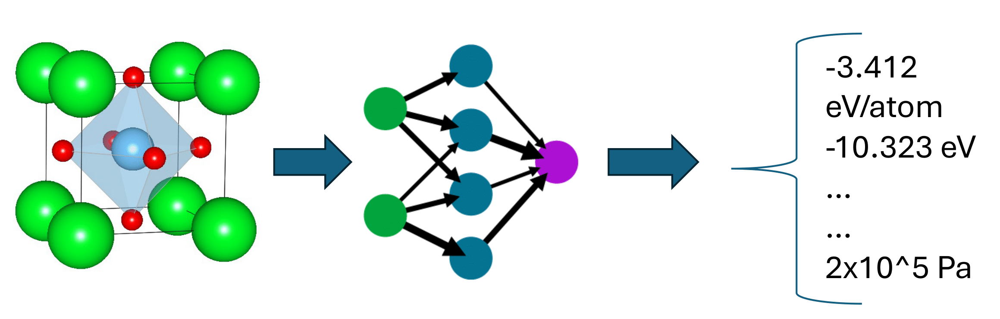
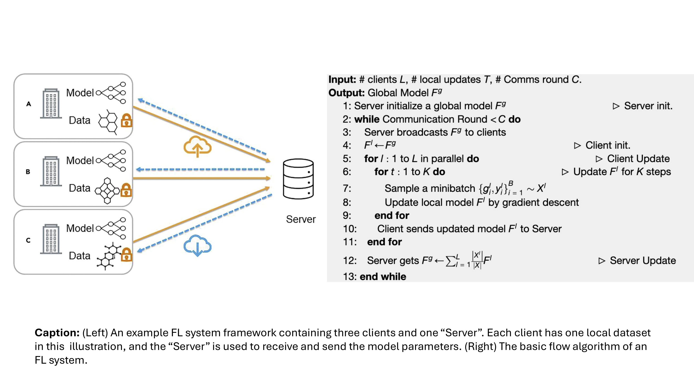

# Federated Learning for Materials Property Prediction

## Project Members
- **Sadman Sadeed Omee**  
  Ph.D. Candidate (Computer Science)  
  Role: Machine Learning researcher   
  Email: somee@email.sc.edu
- **Md Hasibul Amin**  
  Ph.D. Candidate (Computer Engineering)  
  Role: Machine Learning researcher   
  Email: ma77@email.sc.edu
---

## Comments
- How do you determine whether a parameter update from a local client is not deteriorating the performance of the server?
   - We are not planning to do this for a very large number of client nodes because of computational complexity. So, for example, if we have 4 client nodes, we can check all 16 - 1 = 15 combinations to check whether they will degrade the performance before updating the learnable parameters. There are also multiple other efficient techniques such as separate client and server specific validation check, gradient alignment, weighted aggregation, differential testing, etc. can be utilized to track the degraded performances.

- Why FL is needed for this problem?
   - Answered in the **Motivating Examples** section.

---
## Introduction

Materials property prediction has emerged as a crucial aspect of modern materials science, facilitating the discovery of new materials with desirable properties. Machine learning models have made significant strides in predicting these properties from material compositions and structures [1]. However, the limited availability of training data poses a challenge to the accuracy and generalization of these models. Moreover, researchers are more interested in knowing the properties of novel exceptional materials (e.g., having a very high electrical conductivity) that usally fall outside the distribution of known materials set. Federated Learning (FL), a decentralized approach, enables institutions to collaboratively train models without sharing raw data, thus overcoming the data scarcity issue while preserving privacy. Studies has also shown that FL can improve out-of-distribution (OOD) performance in some cases if formulated in a systematic way [2]. This project mostly aims to implement FL for materials property prediction, exploring how well this approach scales with an increasing number of client nodes and assessing the efficiency of the overall system. A secondary goal of this project is to measure how effective FL is in predicting the properties of novel exceptional materials.

## Problem Statement

- **Input**: Material composition or structure data.
- **Output**: Prediction of key material properties, such as formation energy, band gap, etc.

The figure describes the problem, where the material structure is passed through the neural network to get the predicted properties. GNNs are the state-of-the-art models for this task as materials structure are usually encoded as graphs [1].

## Motivating example

Multiple companies are synthesizing drugs, vaccines, medicines, or synthesizing exceptional materials for commercial usage such as blue led with lower band-gap materials, wire made with high electrical conductivity material, etc. The challenge is to screen materials with desired properties from a colossal materials space. Using density functional theory (DFT)-based solution is costly and time-consuming. Recently, researchers are employing ML-based property predictors for screening materials with desired property with a little accuracy-time trade-off. FL allows an organization to help other oragnizations to develop their own ML model for property prediction for screen desired property materials (e.g., lower refractive index materials' glass, etc.) without explicitly giving away the name of the materials they found experimentally and then synthesized in the lab.

## Proposed Solution

We propose to implement **Federated Learning (FL)** for materials property prediction. FL allows institutions to collaboratively train models on distributed data without exchanging sensitive data, enhancing model accuracy while maintaining privacy. FL is already available for molecular property prediction [3] but has not been applied to materials property prediction to our best knowledge. 

### Federated Learning System Details

Federated Learning (FL) allows for decentralized training of machine learning models across multiple clients (e.g., institutions) without sharing raw data. Each client trains a local model on its private dataset and sends the model updates to a central server. The server aggregates these updates to improve the global model, which is then shared with all clients. Here is an image to and algorithm to describe FL in general.

### Key Steps:
1. **Server Initialization**: The server initializes a global model.
2. **Client Model Training**: Each client trains its local model using its own data and updates it through gradient descent.
3. **Model Update**: Clients send their updated model to the server.
4. **Aggregation**: The server aggregates the local models to update the global model.
5. **Re-distribution**: The updated global model is sent back to the clients for the next training round.

This process continues for multiple communication rounds to improve the global model while preserving data privacy.

### ML Component

1. **Model Architectures:**
   - **Graph Neural Networks (GNNs)** for material structure data.
     - Examples: CGCNN, ALIGNN, DeeperGATGNN.
   - **Convolutional Neural Networks (CNNs)** for image-like data.
     - Examples: IRNet, VGG, etc
2. **Datasets:**
   - **In-distribution**: Matbench (7 datasets), MatDeepLearn (6 datasets)
   - **Out-of-distribution**: 3 datasets from Omee et al. [4]
3. **Libraries and Tools:**
   - **PyTorch**: Main deep learning framework for model development.
   - **Pytorch-Geometric (PyG)**: For efficient GNN implementation.
   - **Pymatgen, ASE, Matminer**: For materials data processing.
   - **Federated Learning Tools**: 
     - **PySyft, FedML**: Provides secure and private ML tools for federated learning.
     - **FedChem**: A research package of FL for molecule data (a similar problem).
   - **Scikit-learn**: For pre-processing, metrics, and evaluation.

### Systems Component

1. **FL System Pipeline**:
   - Client-server communication structure.
   - Parameter update schemes to ensure accurate and efficient model convergence.

2. **Server-Client Communication**:
   - Server aggregates local models and redistributes updated models.
   - Communication optimization to reduce bandwidth usage.

3. **Frameworks**:
   - **gRPC**: Communication framework between server and clients.
   - **Docker**: Simulate multiple clients.

## Evaluation

### ML Model Evaluation

1. **Quantitative Metrics**:
   - **Mean Absolute Error (MAE)**, **Mean Squared Error (MSE)**, **Root Mean Squared Error (RMSE)**, **R² Score**.
   - 5-fold **cross validation** for result validation

2. **Qualitative Metrics**:
   - **Prediction performance improvements** with out-of-distribution datasets.
   - Visual learning curves showing the benefit of federated over centralized learning models.

### Systems Evaluation (Focus on Scalability)

1. **Scalability (main focus)**:
   - How many client nodes the FL system can handle efficiently.
   - Monitoring the impact of an increasing number of clients on training time, communication overhead, and model convergence rates.
   
2. **Bandwidth Usage**:
   - Measuring the data transfer for model updates to optimize communication.

3. **Latency**:
   - Monitoring delay in model updates and synchronization to ensure timely convergence.

4. **Privacy**:
   - Evaluating privacy-preserving techniques like differential privacy and secure aggregation.

5. **Design Space Exploration**:
   - Investigating how node configuration (e.g., GPU cores, worker nodes) impacts performance.

We plan to explore and mainly focus on the first evaluation task (scalability) here. If we have more time, we plan to focus on other systems evaluation as well.

### Scalability Experiment Setup

#### Objective:
Determining how many client nodes the Federated Learning (FL) system can handle efficiently, focusing on **training time**, **communication overhead**, and **model convergence rates** as the number of clients increases.

#### Steps:
1. **Client Node Setup**:
   - Starting with a small number of clients (e.g., 10) and gradually increase to larger scales (e.g., 100, 500, 1000 clients).
   
2. **Metrics to Monitor**:
   - **Training Time**: Measuring the time taken to complete one round of training with different numbers of clients.
   - **Communication Overhead**: Tracking the bandwidth usage per round by monitoring the data transferred between the clients and the server.
   - **Model Convergence Rate**: Measuring how quickly the model reaches a predefined accuracy or loss threshold as more clients are added.

3. **Procedure**:
   - For each client size (10, 50, 100, 500, etc.), running the FL training for a fixed number of rounds.
   - Recording the metrics (training time, communication overhead, and convergence rate) at each step.
   
4. **Analysis**:
   - Plotting the training time and communication overhead against the number of clients to determine scalability.
   - Analyzing convergence curves to check if more clients improve or degrade model performance.

## Conclusion

By applying Federated Learning to the problem of materials property prediction, this project aims to improve model performance through collaborative, privacy-preserving learning while solving key scalability challenges in distributed systems. Our focus will be on testing how well the system scales with an increasing number of client nodes, which is critical for evaluating the feasibility of deploying this approach in real-world scenarios. We will also try to improve overall out-of-distribution performance of deep learning models for materials.

## References

[1] Xie, Tian, and Jeffrey C. Grossman. **"Crystal graph convolutional neural networks for an accurate and interpretable prediction of material properties."** *Physical Review Letters* 120, no. 14 (2018): 145301.

[2] Guo, Yaming, Kai Guo, Xiaofeng Cao, Tieru Wu, and Yi Chang. **"Out-of-distribution generalization of federated learning via implicit invariant relationships."** In *International Conference on Machine Learning (ICML)*, pp. 11905-11933. PMLR, 2023.

[3] Zhu, Wei, Jiebo Luo, and Andrew D. White. **"Federated learning of molecular properties with graph neural networks in a heterogeneous setting."** *Patterns* 3, no. 6 (2022).

[4] Omee, Sadman Sadeed, Nihang Fu, Rongzhi Dong, Ming Hu, and Jianjun Hu. **"Structure-based out-of-distribution (OOD) materials property prediction: a benchmark study."** *npj Computational Materials* 10, no. 1 (2024): 144.